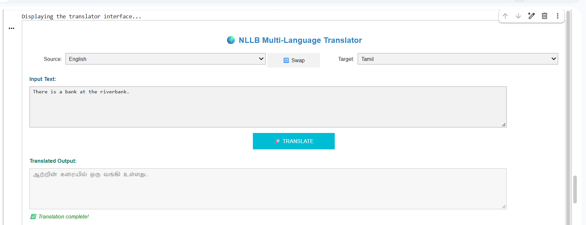
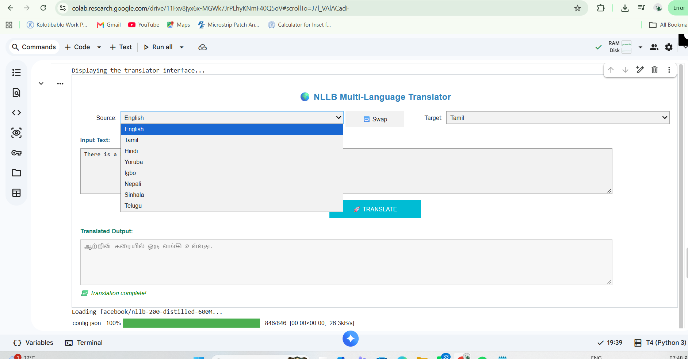

# Multilingual Context-Aware Translator using NLLB-200

A multilingual translation system developed using **Meta's NLLB-200 transformer model**, **Python**, and **ipywidgets**. The system provides an interactive interface for translating text between multiple languages without requiring English as an intermediate language.

## Project Overview

The project focuses on multilingual translation for low-resource language pairs using the **NLLB-200** multilingual neural translation model.

The application provides an interactive interface in which users can:

- Select a source language
- Select a target language
- Enter text for translation
- Translate the text
- Swap the source and target languages
- View the translated output

The system was implemented using Python and ipywidgets and tested with multiple language pairs.

---

## Objectives

The main objectives of this project are:

1. To develop a multilingual translation system using NLLB-200.
2. To support direct translation between multiple language pairs.
3. To provide an interactive translation interface.
4. To support low-resource multilingual translation.
5. To provide source and target language selection.
6. To implement bidirectional language swapping.
7. To demonstrate transformer-based multilingual NLP.

---

## Key Features

### Multilingual Translation

The system uses the NLLB-200 model for multilingual translation.

The current implementation provides the following language options:

- English
- Tamil
- Hindi
- Yoruba
- Igbo
- Nepali
- Sinhala
- Telugu

### Direct Language-Pair Translation

The system is designed to translate directly between selected language pairs instead of requiring English as a pivot language.

### Interactive User Interface

The interface is implemented using `ipywidgets`.

It contains:

- Source language dropdown
- Target language dropdown
- Swap button
- Input text box
- Translate button
- Output text box
- Translation status message

### Language Swapping

The **Swap** button exchanges the selected source and target languages.

### Input Validation

The application checks whether the user has entered text before performing translation.

It also validates the selected language codes.

### Translation Status

The interface displays status information such as:

```text
Ready to translate...
Translating...
Translation complete!
```

---

## Technologies Used

### Programming Language

- Python

### AI / NLP Model

- Meta NLLB-200
- `facebook/nllb-200-distilled-600M`

### Python Libraries

- Transformers
- PyTorch
- ipywidgets
- IPython
- Time

### Development Environment

- Google Colab
- Jupyter Notebook

---

## NLLB-200 Model

The project uses:

```text
facebook/nllb-200-distilled-600M
```

The model is loaded using the Hugging Face Transformers library.

The model and tokenizer are initialized using:

```python
AutoTokenizer
AutoModelForSeq2SeqLM
```

The implementation also checks whether a CUDA-enabled GPU is available and uses it when available.

---

## Supported Languages

The current application defines these language mappings:

| Language | NLLB Language Code |
|---|---|
| English | `eng_Latn` |
| Tamil | `tam_Taml` |
| Hindi | `hin_Deva` |
| Yoruba | `yor_Latn` |
| Igbo | `ibo_Latn` |
| Nepali | `nep_Deva` |
| Sinhala | `sin_Sinh` |
| Telugu | `tel_Telu` |

These language codes are used to prepare the source and target languages for the NLLB model.

---

## System Architecture

```text
User
 │
 ▼
Interactive ipywidgets Interface
 │
 ├── Source Language
 ├── Target Language
 ├── Input Text
 └── Translate Button
 │
 ▼
Language Code Mapping
 │
 ▼
NLLB-200 Tokenizer
 │
 ▼
NLLB-200 Transformer Model
 │
 ▼
Generated Translation
 │
 ▼
Output Text Box
```

---

## Translation Workflow

```text
Start
 │
 ▼
Import Required Libraries
 │
 ▼
Define Supported Languages
 │
 ▼
Load NLLB-200 Model
 │
 ▼
Initialize Tokenizer
 │
 ▼
Create Interactive GUI
 │
 ▼
Select Source Language
 │
 ▼
Select Target Language
 │
 ▼
Enter Input Text
 │
 ▼
Translate
 │
 ▼
Generate Output
 │
 ▼
Display Translation
```

---

## Application Interface

### Main Translator Interface



The interface provides source and target language selection, text input, translation, and output display.

### Language Selection



The language dropdown provides the currently supported language options.

---

## Translation Logic

The application first converts the selected source and target languages into their corresponding NLLB language codes.

The input text is then passed to the tokenizer.

The model generates the translated sequence using the selected target language token.

The resulting tokens are decoded back into readable text and displayed in the output box.

---

## User Interface Components

### Source Language Dropdown

Allows the user to select the language of the input text.

### Target Language Dropdown

Allows the user to select the required output language.

### Swap Button

The swap button exchanges the source and target languages.

### Input Text Area

Used to enter the sentence or text to be translated.

### Translate Button

Starts the translation process.

### Output Text Area

Displays the generated translation.

### Status Label

Displays the current translation status and validation messages.

---

## Error Handling

The application contains basic error handling for:

- Empty input text
- Invalid language selections
- Model loading errors
- Translation errors

For example, an empty input produces a warning requesting the user to enter text.

---

## Results

The project documentation reports testing with multiple language pairs.

| Test Pair | BLEU Score | Observation |
|---|---:|---|
| Tamil → Afrikaans | 0.74 | Idioms and tenses preserved well |
| Hindi → Yoruba | 0.69 | Minor lexical drift |
| English → Telugu | 0.78 | Very stable translation |
| Tamil → English | 0.85 | High accuracy with minimal post-editing |

These values are the results reported in the project paper. :contentReference[oaicite:1]{index=1}

---

## Example Translation

Example:

```text
Source Language:
English

Input:
There is a bank at the riverbank.

Target Language:
Tamil

Output:
ஆற்றின் கரையில் ஒரு வங்கி உள்ளது.
```

---

## Project Files

### `src/multilingual_translator.py`

Contains the main Python implementation of the translator.

It includes:

- NLLB model initialization
- Tokenizer initialization
- Language mapping
- Translation function
- ipywidgets interface
- Language swapping
- Input validation
- Output generation
- Status handling

### `notebooks/Multilingual_Translator.ipynb`

Contains the notebook version of the project used for the interactive development and demonstration environment.

### `documentation/Multilingual_Context_Aware_Translator_NLLB.pdf`

Contains the project paper documenting the system architecture, working process, results, conclusion, and references.

### `images/`

Contains screenshots of the translator interface.

---

## Repository Structure

```text
Multilingual-Translator-NLLB-200/
│
├── README.md
│
├── src/
│   └── multilingual_translator.py
│
├── notebooks/
│   └── Multilingual_Translator.ipynb
│
├── documentation/
│   └── Multilingual_Context_Aware_Translator_NLLB.pdf
│
└── images/
    ├── translator_english_to_tamil.png
    └── translator_language_selection.png
```

---

## Installation

Install the required Python packages:

```bash
pip install transformers torch ipywidgets
```

---

## Running the Project

### Option 1 — Google Colab

Open:

```text
notebooks/Multilingual_Translator.ipynb
```

in Google Colab or a compatible Jupyter environment.

Run the cells to:

1. Import the required libraries.
2. Load the NLLB-200 model.
3. Initialize the tokenizer.
4. Display the translator interface.
5. Select the source and target languages.
6. Enter the input text.
7. Click **TRANSLATE**.

### Option 2 — Python Script

Run:

```bash
python src/multilingual_translator.py
```

The script requires an environment capable of displaying the ipywidgets interface.

---

## Hardware Requirements

No dedicated hardware is required.

The project runs as a software-based NLP application and can be executed in environments such as:

- Google Colab
- Jupyter Notebook
- Python environments supporting ipywidgets

---

## Project Applications

Potential applications include:

- Multilingual communication
- Educational tools
- Language learning
- Accessibility applications
- Research in multilingual NLP
- Low-resource language translation
- Cross-cultural communication

---

## Future Enhancements

Possible future improvements include:

- Additional language support
- Domain-specific fine-tuning
- Speech-to-text integration
- Text-to-speech integration
- Improved translation evaluation
- Larger interactive interfaces
- Web-based deployment
- API integration
- Enhanced error handling
- Additional language-pair testing

The project paper identifies domain-specific fine-tuning, speech-to-text, text-to-speech, and hybrid semantic enhancement as possible future directions. :contentReference[oaicite:2]{index=2}

---

## Project Status

**Status:** Completed Academic Prototype

The repository contains the main Python source code, Colab notebook, project documentation, and interface screenshots.

---

## Team Members

### 1. Mohammed Sheik Syed T

GitHub:  
https://github.com/heyy-sheiksyed

### 2. Mohammed Thoufeeq Ali S M

GitHub:  
https://github.com/MdThoufeeq

### 3. Mukesh Raj K

GitHub:  
https://github.com/MukeshrajKumaran

---

## Institution

**B.S. Abdur Rahman Crescent Institute of Science and Technology**

**Department of Electronics and Communication Engineering**

---

## Project Documentation

The detailed project paper is available at:

```text
documentation/Multilingual_Context_Aware_Translator_NLLB.pdf
```

The paper documents the NLLB-200 model, Python and ipywidgets interface, multilingual architecture, translation workflow, testing, results, and conclusion. :contentReference[oaicite:3]{index=3}

---

## License

No specific open-source license has been added to this repository at this time.
